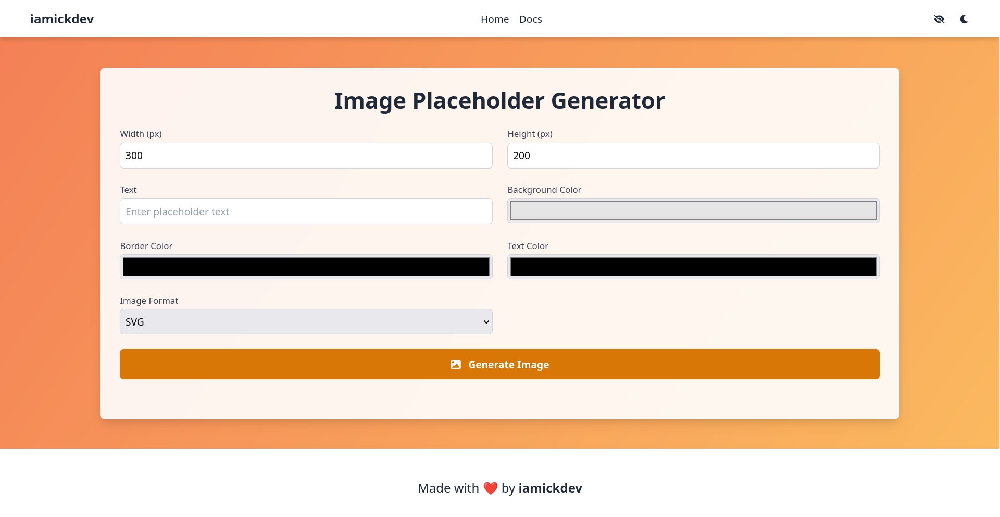

<div align="center">

# Image Placeholder Generator


[](https://opensource.org/licenses/MIT) [](https://github.com/arnonsang/image-placeholder/stargazers) [](https://github.com/arnonsang/image-placeholder/issues) 

A single-file simple image placeholder generator tool to create placeholder images for your projects and websites. This project is built with [Go](https://go.dev/) and [Fiber](https://gofiber.io/)

[](https://placeholder.iamickdev.com) [](https://placeholder.iamickdev.com/docs)

[Features](#-features) • [Usage](#-usage) • [Installation](#-installation) • [API](#api-endpoints) • [Todo](#-to-do-list) • [Contributing](#-contributing) • [Acknowledgments](#-acknowledgments) • [License](#license)



</div>

## 🌟 Features

- 📋 Dynamic placeholder image generate via parameters and query
- ✅ Supports custom width, height, and background color
- 🌐 User-friendly web interface for easy testing and usage

## 🚀 Usage

### API Endpoints

| Method | Endpoint                  | Description                                       |
| ------ | ------------------------- | ------------------------------------------------- |
| GET    | `/readyz`                | Health check endpoint                             |
| GET    | `/:format/:width/:height/:text`              | Generate a placeholder image with the specified width, height, and text |

### Parameters

| Parameter | Description | Default |
| --------- | ----------- | ------- |
| `format`  | Image format (png, jpg, jpeg) |  |
| `width`   | Image width in pixels | `150` |
| `height`  | Image height in pixels | `150` |
| `text`    | Text to display on the image | `width x height` |

### Example

```bash
# Generate a 300x300 placeholder image with the text "Hello World"
https://placeholder.iamickdev.com/svg/300/300/Hello%20World
```


### Web Interface

Access the intuitive web interface by navigating to [placeholder.iamickdev.com](https://placeholder.iamickdev.com)


## 📝 TODO List

- [x] Add support for custom text
- [ ] Add support for custom font size
- [ ] Add support for custom font family
- [ ] Add support for custom border radius
- [ ] Add support for custom border size

## 💻 Installation

1. Clone this repository:
```bash
git clone https://github.com/arnonsang/image-placeholder.git
```
2. Navigate to the project directory:
```bash
cd image-placeholder
```
3. Install the dependencies:
```bash
go mod tidy
```
4. Start the server:
```bash
go run .
```

5. Access the application at `http://localhost:4000` in your browser or use the API endpoints directly.


## 📦 Dependencies

- [Go](https://golang.org/) - The programming language powering the server
- [Fiber](https://gofiber.io/) - Express-inspired web framework for Go
- [Tailwind CSS](https://tailwindcss.com/) - A utility-first CSS framework for rapid UI development


## 🎉 Contributing

Contributions, issues, and feature requests are welcome! Feel free to check [issues page](https://github.com/arnonsang/image-placeholder/issues) or open [pull request](https://github.com/arnonsang/image-placeholder/pulls).

## 📄 License

This project is licensed under the MIT License - see the [LICENSE](LICENSE) file for details.

## 🙏 Acknowledgments

We'd like to tip our hats to:

- The awesome folks at **[favicon.io](https://favicon.io/favicon-generator/)** for their fantastic favicon generator. It's made our app look snazzy!

Your resources have been invaluable in making this project shine. Thank you! 🌟

## Author

Made with ❤️ by **[iamickdev](https://www.iamickdev.com)**
- Website: [www.iamickdev.com](https://www.iamickdev.com)
- Github: [@arnonsang](https://github.com/arnonsang)

---
